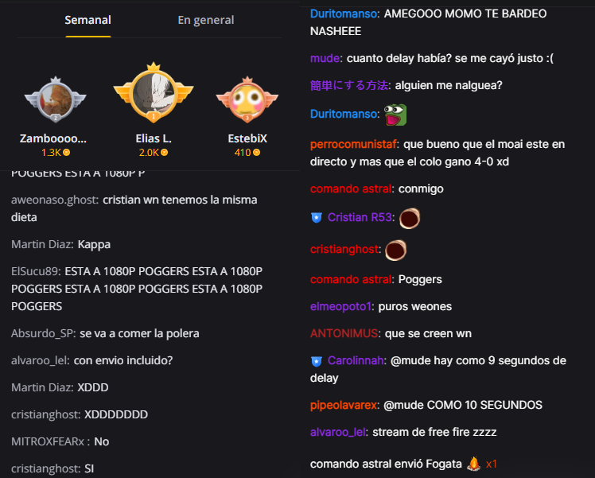
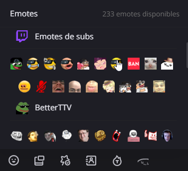
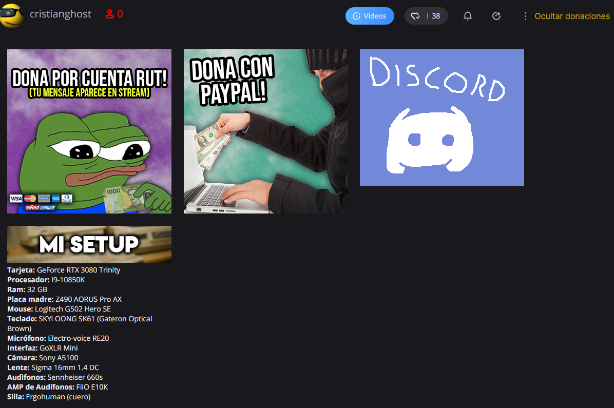

# Booyah.tv 0.25
   Esta extención incorpora elementos de twitch.tv a booyah.live  Booyah  Booyah  Booyah

## Caracteristicas

1. Emotes incorporados sin nesesidad de configuración alguna
2. Nombres de usuario con colores
4. Panel de emotes
5. Poder ocultar las donaciones (fogatas, y esas weas)
6. Diseño similar a Twitch.tv (fuentes, etc)

### Chat

### Panel de Emotes

### Paneles

## Canales

Canales donde esta disponible la extensión:

* Cristianghost
* Dylantero
* [MoaiGR](https://booyah.live/channels/63681555)
* [Suwie](https://booyah.live/channels/71614581)

## Emotes

Emotes que estan incorporados:

* Emotes de twitch
* Emotes de subs
* [BetterTTV Global](https://betterttv.com)
* [Franker Face Z Global / del canal](https://www.frankerfacez.com)

## Falta por implementar...

* Autocompletador de emotes de Franker Face Z (**:OMEGA..** y se despliega un panel de emotes)
* Popup
* Tooltip para los emotes (eso que sale al pasar por encima de un emote en el panel, sale el nombre del emote, canal,etc)
* Crear una version para Firefox, Safari,etc